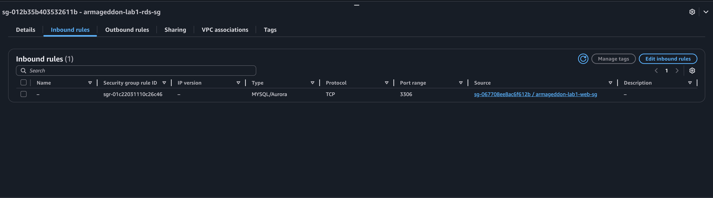
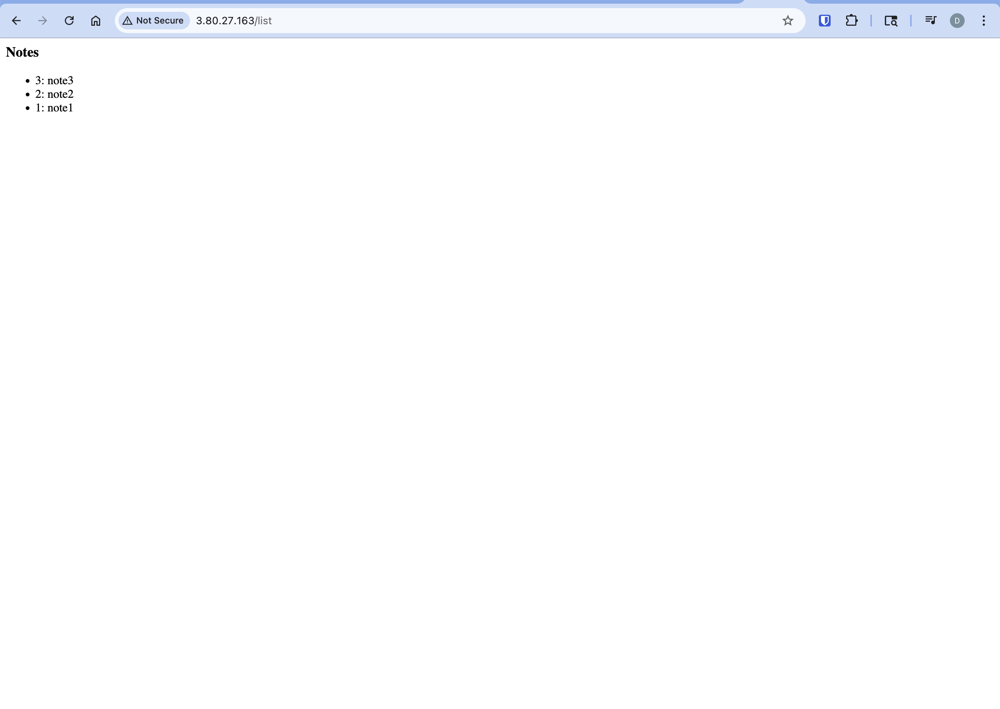
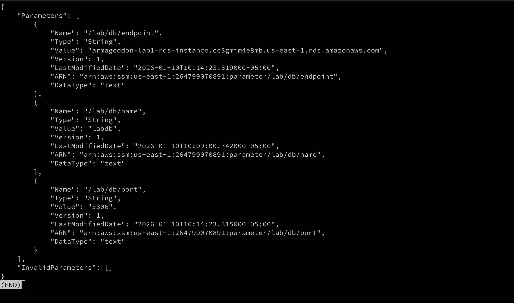
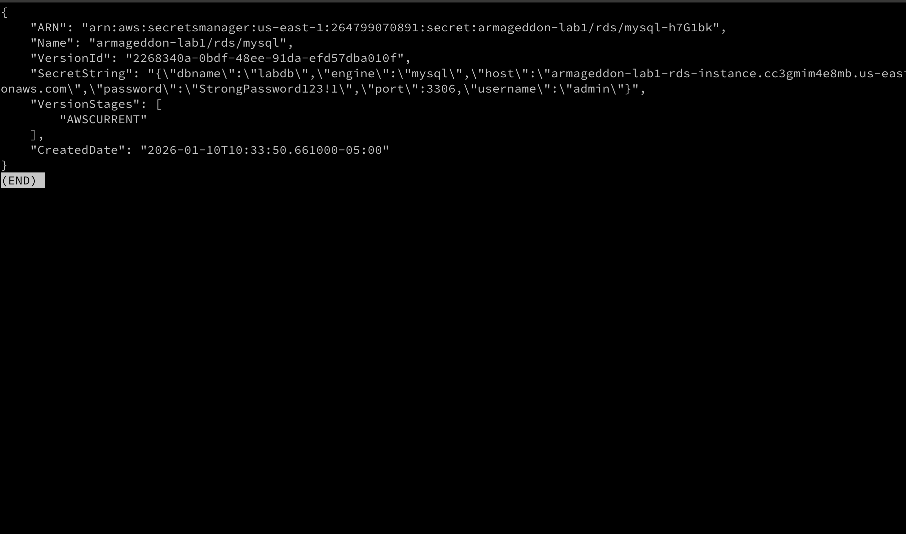
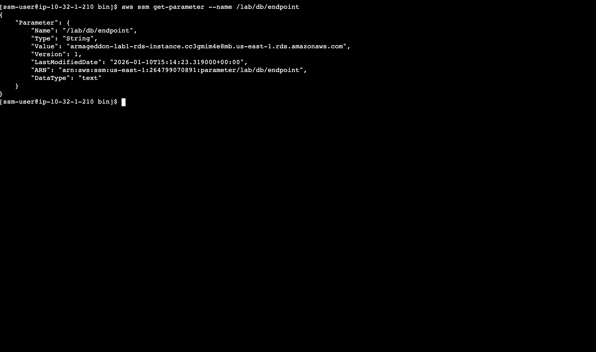
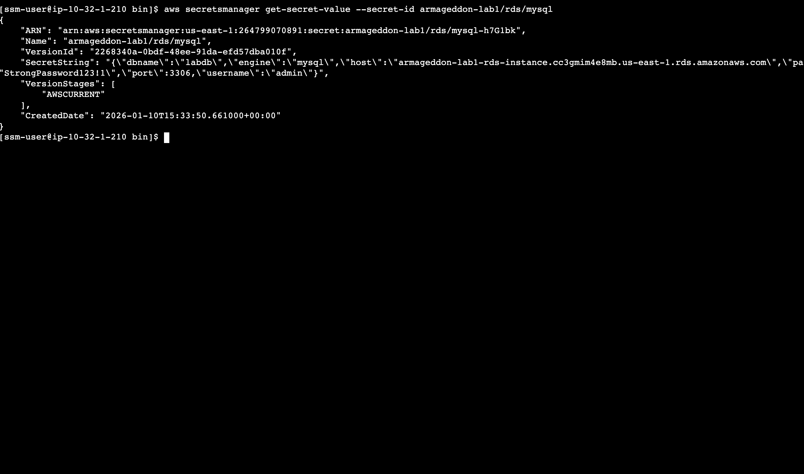
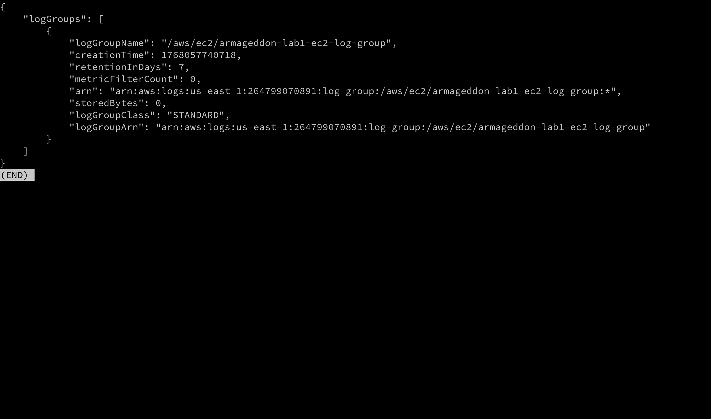
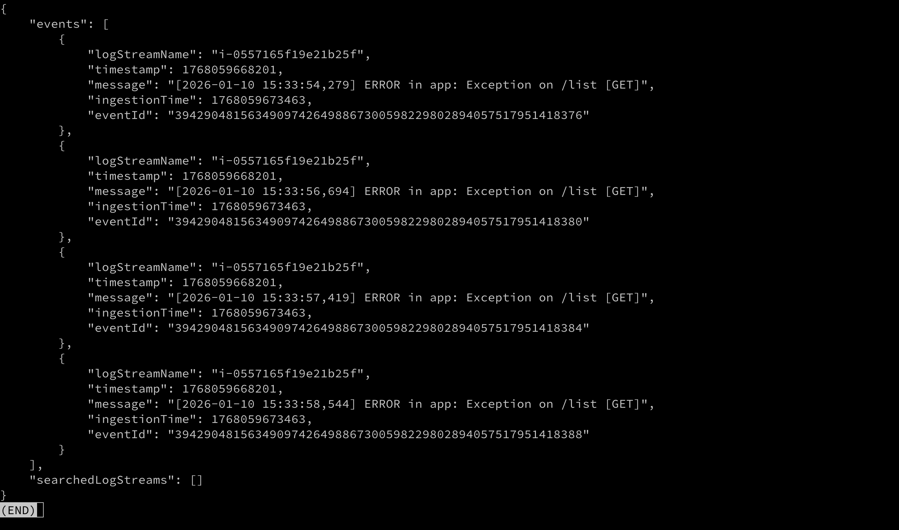
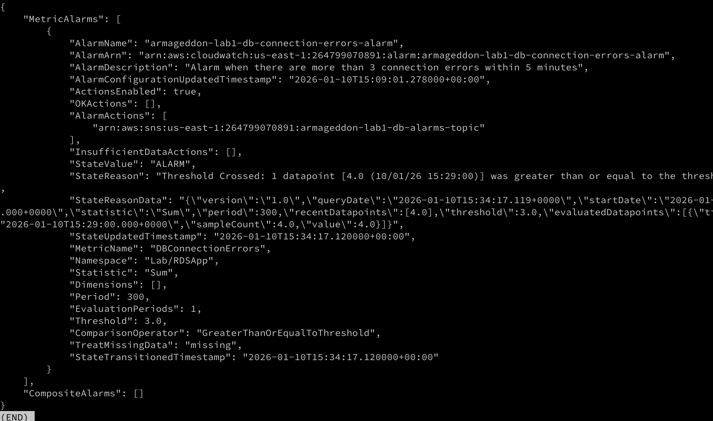

# Lab 1A

1. Screenshot of: RDS SG inbound rule using source = sg-ec2-lab EC2 role attached /list output showing at least 3 notes
   
   

2. Short answers:
   A) Why is DB inbound source restricted to the EC2 security group?
   <span style="color:#2BA9E5;font-weight:bold;">To restrict what can access the database. Only the server with the web application should be able to connect to the instance</span>
   B) What port does MySQL use?
   <span style="color:#2BA9E5;font-weight:bold;">3306</span>
   C) Why is Secrets Manager better than storing creds in code/user-data?
   <span style="color:#2BA9E5;font-weight:bold;">Secrets manager offers serveral benefits including rotation, the ability to have multiple consumers get the secret from one place and the value is kept "secret". If you stored the secret in your app code/user data, you'd need to connect to the instance or deploy a new instance whenever the password changed or the host for the db changed.</span>
3. [`aws ec2 describe-security-groups --group-ids sg-0ea85e501b39c5967 sg-085cd6a3d7b90fe01 > sg.json`](sg.json)

   [`aws rds describe-db-instances --db-instance-identifier armageddon-lab1-rds-instance > rds.json`](rds.json)

   [`aws secretsmanager describe-secret --secret-id armageddon-lab1/rds/mysql > secret.json`](secret.json)

   [`aws iam list-attached-role-policies --role-name armageddon-lab1-ec2-role > role-policies.json`](role-policies.json)

The security group rule on the web security group that allows inbound 80 and 443 exists to allow the open internet to connect to the website. The outbound rule on the web security group is to allow session manager to work and to allow the instance to get updates to packages.

The security group rule on the rds security group that allows inbound on 3306 from the web security group is to allow mysql access ONLY to the web security group. Broader access is forbidden in order to restrict who can access the database. At this point, only the application needs to access the database.

The instance role exists to give the EC2 instance access to AWS resources that it needs. It can only read one specific secret, because in the resource policy we specified the permission `GetSecretValue` only on one secret.

# Lab 1B

## Verification

```bash
aws ssm get-parameters \
  --names /lab/db/endpoint /lab/db/port /lab/db/name \
  --with-decryption
```



```bash
  aws secretsmanager get-secret-value \
  --secret-id armageddon-lab1/rds/mysql
```



`aws ssm get-parameter --name /lab/db/endpoint `

`aws secretsmanager get-secret-value --secret-id armageddon-lab1/rds/mysql`


```bash
aws logs describe-log-groups \
  --log-group-name-prefix /aws/ec2
```


--> Log group name: /aws/ec2/armageddon-lab1-ec2-log-group

```bash
aws logs filter-log-events \
  --log-group-name /aws/ec2/armageddon-lab1-ec2-log-group \
  --filter-pattern "ERROR"
```



```bash
aws cloudwatch describe-alarms \
  --alarm-name-prefix armageddon-lab1-db-connection
```



## Runbook Section 2

- I observed that the logs had connection errors
- I observed that the password in the secret has been changed
- I rolled the password back to a known good state
- After rolling back the password, I was able to access the `/list` page with no errors and saw no additional errors in the log
- After rolling back the password, within the 5 minute window the alarm returned to an OK state

\*\*Access to `/list` was verification that the ec2 instance could still connect to rds on port 3306 and that the rds instance was running.

## Incident Summary

On January 10, 2026 at 1034ET I received an email ALARM for `armageddon-lab1-db-connection-errors-alarm`. The alarm indicated that over the last 5 minutes there had been at least 3 connection errors. Initial attempts to access the site resulted in 500 errors.

Using the available runbook, I checked for the presence of the connection secret. After verifying that the secret existed, I checked its values against the last known good state. The password had been changed. I updated the value back to the last known good state. After changing the password back, I was able to access the application, verify that no more error logs were occurring and monitor the alarm until it returned to the OK state.

Follow up actions:

- restrict who can edit the secret value for the db connection information

## Reflection Questions

A) Why might Parameter Store still exist alongside Secrets Manager?
<span style="color:#2BA9E5;font-weight:bold;">All values in parameter store don't require rotation or encryption. For example, if you store the name of your db or another configuration value like bucket name, you may never want to change it or need to encrypt it.</span>
B) What breaks first during secret rotation?
<span style="color:#2BA9E5;font-weight:bold;">Any open connections may fail. If you cached the result then anything using the cached value will fail. The aformentioned depends on if the previous credentail is revoked or not.</span>
C) Why should alarms be based on symptoms instead of causes?
<span style="color:#2BA9E5;font-weight:bold;">Let's take the scenario where the applicaiton is throwing errors because it can't connect to the db. The symptoms are 500 errors and application connection errors. It doesn't matter if the cause was someone changing the db password incorrectly, deleting the secret or the db going offline, you still have the same symptoms. Erroring based on the symptoms gives you more consistency and covers a variety of causes.</span>
D) How does this lab reduce mean time to recovery (MTTR)?
<span style="color:#2BA9E5;font-weight:bold;">The alarm lets you know pretty quickly if there's a failure. The logs give information about the error.</span>
E) What would you automate next?
<span style="color:#2BA9E5;font-weight:bold;">

1. Password rotation
2. Reverting any rotations if the alarm triggers
   </span>

# Lab 1C - Bonus A

```bash
aws ec2 describe-instances \
--instance-ids i-0f4e21b1e832fb805 \
--query "Reservations[].INstances[].PUblicIpAddress"

[]
```

```bash
aws ec2 describe-vpc-endpoints \
  --filters "Name=vpc-id,Values=vpc-0449d3929141e0992" \
  --query "VpcEndpoints[].ServiceName"

[
    "com.amazonaws.us-east-1.logs",
    "com.amazonaws.us-east-1.ssm",
    "com.amazonaws.us-east-1.secretsmanager",
    "com.amazonaws.us-east-1.monitoring",
    "com.amazonaws.us-east-1.ssmmessages",
    "com.amazonaws.us-east-1.ec2messages",
    "com.amazonaws.us-east-1.kms"
]
```

```bash
# provides info on managed nodes
aws ssm describe-instance-information \
  --query "InstanceInformationList[].InstanceId"

[
    "i-0f4e21b1e832fb805"
]
```

```bash
# from instance

[ssm-user@ip-10-32-11-238 bin]$ aws ssm get-parameter --name "/lab/db/endpoint"
{
    "Parameter": {
        "Name": "/lab/db/endpoint",
        "Type": "String",
        "Value": "armageddon-lab1-rds-instance.cc3gmim4e8mb.us-east-1.rds.amazonaws.com",
        "Version": 1,
        "LastModifiedDate": "2026-01-11T00:29:09.552000+00:00",
        "ARN": "arn:aws:ssm:us-east-1:264799070891:parameter/lab/db/endpoint",
        "DataType": "text"
    }
}

[ssm-user@ip-10-32-11-238 bin]$ aws secretsmanager get-secret-value --secret-id armageddon-lab1/rds/mysql
{
    "ARN": "arn:aws:secretsmanager:us-east-1:264799070891:secret:armageddon-lab1/rds/mysql-M3stBD",
    "Name": "armageddon-lab1/rds/mysql",
    "VersionId": "terraform-20260111002909380400000006",
    "SecretString": "{\"dbname\":\"labdb\",\"engine\":\"mysql\",\"host\":\"armageddon-lab1-rds-instance.cc3gmim4e8mb.us-east-1.rds.amazonaws.com\",\"password\":\"<redacted>\",\"port\":3306,\"username\":\"admin\"}",
    "VersionStages": [
        "AWSCURRENT"
    ],
    "CreatedDate": "2026-01-11T00:29:09.581000+00:00"
}

[ssm-user@ip-10-32-11-238 bin]$ aws logs describe-log-streams --log-group-name /aws/ec2/armageddon-lab1-ec2-log-group
{
    "logStreams": [
        {
            "logStreamName": "i-0f4e21b1e832fb805",
            "creationTime": 1768093570844,
            "firstEventTimestamp": 1768093565770,
            "lastEventTimestamp": 1768093565770,
            "lastIngestionTime": 1768093571046,
            "uploadSequenceToken": "49039859657907917269136458796356960238174614901495219764",
            "arn": "arn:aws:logs:us-east-1:264799070891:log-group:/aws/ec2/armageddon-lab1-ec2-log-group:log-stream:i-0f4e21b1e832fb805",
            "storedBytes": 0
        }
    ]
}
```

# Lab 1C - Bonus B

```bash
aws elbv2 describe-load-balancers
--names armageddon-lab1-alb
--query "LoadBalancers[0].State.Code"

"active"


aws elbv2 describe-listeners
--load-balancer-arn arn:aws:elasticloadbalancing:us-east-1:264799070891:loadbalancer/app/armageddon-lab1-alb/56781c8c425f3837
--query "Listeners[].Port"

[
    443,
    80
]

aws elbv2 describe-target-health
--target-group-arn arn:aws:elasticloadbalancing:us-east-1:264799070891:targetgroup/armageddon-lab1-tg/c5cb5f04541eaf8f
{
    "TargetHealthDescriptions": [
        {
            "Target": {
                "Id": "i-0f9718c953ce000c0",
                "Port": 80
            },
            "HealthCheckPort": "80",
            "TargetHealth": {
                "State": "healthy"
            },
            "AdministrativeOverride": {
                "State": "no_override",
                "Reason": "AdministrativeOverride.NoOverride",
                "Description": "No override is currently active on target"
            }
        }
    ]
}


aws wafv2 get-web-acl-for-resource
--resource-arn arn:aws:elasticloadbalancing:us-east-1:264799070891:loadbalancer/app/armageddon-lab1-alb/56781c8c425f3837
{
    "WebACL": {
        "Name": "armageddon-lab1-waf",
        "Id": "aae510b6-dd88-4dbf-9edc-e6d9644e6611",
        "ARN": "arn:aws:wafv2:us-east-1:264799070891:regional/webacl/armageddon-lab1-waf/aae510b6-dd88-4dbf-9edc-e6d9644e6611",
        "DefaultAction": {
            "Allow": {}
        },
        "Description": "",
        "Rules": [
            {
                "Name": "AWSManagedRulesCommonRuleSet",
                "Priority": 1,
                "Statement": {
                    "ManagedRuleGroupStatement": {
                        "VendorName": "AWS",
                        "Name": "AWSManagedRulesCommonRuleSet",
                        "RuleActionOverrides": [
                            {
                                "Name": "SizeRestrictions_BODY",
                                "ActionToUse": {
                                    "Count": {}
                                }
                            }
                        ]
                    }
                },
                "OverrideAction": {
                    "None": {}
                },
                "VisibilityConfig": {
                    "SampledRequestsEnabled": true,
                    "CloudWatchMetricsEnabled": true,
                    "MetricName": "armageddon-lab1-waf-common-rules"
                }
            }
...

aws cloudwatch describe-alarms --alarm-name-prefix armageddon-lab1-alb-5xx-error-alarm
{
    "MetricAlarms": [
        {
            "AlarmName": "armageddon-lab1-alb-5xx-error-alarm",
            "AlarmArn": "arn:aws:cloudwatch:us-east-1:264799070891:alarm:armageddon-lab1-alb-5xx-error-alarm",
            "AlarmDescription": "Alarm when ALB 5xx errors exceed threshold",
            "AlarmConfigurationUpdatedTimestamp": "2026-01-13T01:56:40.129000+00:00",
            "ActionsEnabled": true,
            "OKActions": [],
            "AlarmActions": [
                "arn:aws:sns:us-east-1:264799070891:armageddon-lab1-alarms-topic"
            ],
            "InsufficientDataActions": [],
            "StateValue": "OK",
            "StateReason": "Threshold Crossed: no datapoints were received for 1 period and 1 missing datapoint was treated as [NonBreaching].",
            "StateReasonData": "{\"version\":\"1.0\",\"queryDate\":\"2026-01-13T01:57:48.092+0000\",\"statistic\":\"Sum\",\"period\":300,\"recentDatapoints\":[],\"threshold\":10.0,\"evaluatedDatapoints\":[{\"timestamp\":\"2026-01-13T01:50:00.000+0000\"}]}",
            "StateUpdatedTimestamp": "2026-01-13T01:57:48.094000+00:00",
            "MetricName": "HTTPCode_ELB_5XX_Count",
            "Namespace": "AWS/ApplicationELB",
            "Statistic": "Sum",
            "Dimensions": [
                {
                    "Name": "LoadBalancer",
                    "Value": "arn:aws:elasticloadbalancing:us-east-1:264799070891:loadbalancer/app/armageddon-lab1-alb/56781c8c425f3837"
                }
            ],
            "Period": 300,
            "EvaluationPeriods": 1,
            "Threshold": 10.0,
            "ComparisonOperator": "GreaterThanOrEqualToThreshold",
            "TreatMissingData": "notBreaching",
            "StateTransitionedTimestamp": "2026-01-13T01:57:48.094000+00:00"
        }
    ],
...

aws cloudwatch list-dashboards --dashboard-name-prefix armageddon
{
    "DashboardEntries": [
        {
            "DashboardName": "armageddon-lab1-dashboard",
            "DashboardArn": "arn:aws:cloudwatch::264799070891:dashboard/armageddon-lab1-dashboard",
            "LastModified": "2026-01-13T01:56:41+00:00",
            "Size": 903
        }
    ]
}


```
