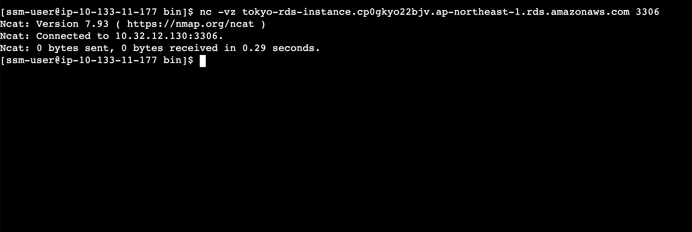

# 3A

|Site|Region|CIDR|
|Tokyo|ap-northeast-1|10.32.0.0/16|
|Sao Paulo|sa-east-1|10.133.0.0/16|

## Test reachability from SP to Tokyo RDS instance

## Routes

`aws ec2 describe-route-tables --filters "Name=vpc-id,Values=vpc-0dd9d3439b6d5ac60" --query "RouteTables[].Routes[]" --region sa-east-1 > ~/projects/bmc-class/group-aws-armageddon/Deliverables/Lab3/sao_paulo_routes.json`

[Sao Paulo Routes](sao_paulo_routes.json)

`aws ec2 describe-route-tables --filters "Name=vpc-id,Values=vpc-0e72e50641359621d" --query "RouteTables[].Routes[]" --region ap-northeast-1 > ~/projects/bmc-class/group-aws-armageddon/Deliverables/Lab3/tokyo_routes.json`

[Tokyo Routes](tokyo_routes.json)
